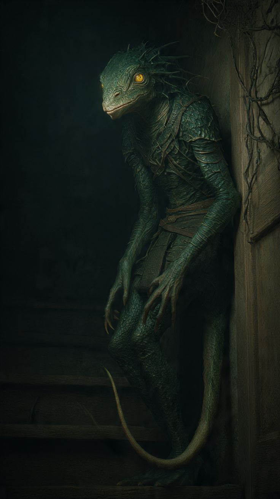

# Servitore Bido

*Riferimento visivo di Bido.*

## Ruolo

Bido è il fido servitore dei re e dei regnanti dei Falchi da tempo immemore. È una creatura originaria dell'Isola di Sanda, selezionata, addestrata e inviata in missione con lo scopo di diventare la consigliera del regnante.

Anche se la sua origine è ora conosciuta dal Master, per i regnanti e per il resto del mondo Bido sembra semplicemente seguire il sovrano del momento dei Falchi, passando da un regnante all'altro senza mai spiegare la propria storia.

## La Gorgiera della Parola Profonda

Bido porta una gorgiera sottile, simile a un torque, con una pietra verde incastonata all'altezza della gola. Gli è stata donata dagli uomini che abitano l'Isola del Non Ritorno, prima che Bido partisse per la sua missione. Il motivo per cui gliel'hanno affidata e il loro progetto reale restano sconosciuti.

La pietra conferisce a Bido un intelletto superiore, rendendolo capace di comprendere rapidamente persone, situazioni e rapporti di potere. La gorgiera amplifica anche la sua voce e il peso delle sue parole, permettendogli di consigliare, avvelenare i pensieri e stregare con una precisione innaturale.

Non è ancora chiaro se l'intelligenza di Bido sia soltanto un dono della pietra o se l'accessorio abbia risvegliato capacità già presenti nella creatura di Sanda.

## Presenza e comportamento

Bido è sempre pronto a servire e a consigliare il regnante nei momenti di sfiducia o quando ha bisogno di un parere. Non si impone mai e raramente esprime un ordine diretto.

La sua presenza è discreta e costante. Può restare in silenzio per lunghi periodi, osservando il regnante e il corso degli eventi, per poi intervenire con poche parole quando ritiene che il suo consiglio sia necessario.

## Il potere delle parole

Bido è estremamente bravo ad avvelenare i pensieri e a stregare con le parole. Non persuade attraverso la forza o l'autorità, ma orientando lentamente il modo in cui il regnante interpreta una situazione.

La sua influenza è tanto più pericolosa perché non appare come un'imposizione. Bido sa presentare una propria idea come se fosse una conclusione maturata autonomamente dal sovrano. Quando il regnante prende una decisione, spesso crede di averlo fatto da solo.

## Rapporto con Valor Nox

Con Valor Nox, Bido rappresenta la memoria personale dell'epoca imperiale e l'unica figura capace di conoscere ciò che il barone era prima delle ferite, degli augment e della sconfitta.

Il dualismo tra i due è netto:

- Valor Nox è consumato dalla storia, dalle guerre, dalle sconfitte e dal peso delle proprie scelte;
- Bido sembra non essere stato toccato dalla storia, come se dinastie, guerre e crolli non avessero mai lasciato traccia su di lui.

Bido può conoscere il dolore del barone meglio di chiunque altro, ma non è chiaro se lo protegga, lo assecondi o lo guidi verso decisioni che servono un disegno più antico.

## Fedeltà

Non è ancora chiaro se la sua fedeltà appartenga a Valor Nox, alla carica del regnante o alla continuità stessa del potere.

La sua fedeltà appare assoluta finché il regnante conserva il proprio ruolo. Resta da capire cosa farebbe Bido se Valor Nox dovesse perdere il titolo, morire o essere sostituito.

## Origine e missione

Bido proviene dall'Isola di Sanda, ma non è ancora chiaro da quale comunità, stirpe o gruppo di creature. Dopo aver ricevuto la Gorgiera della Parola Profonda dagli uomini dell'Isola del Non Ritorno, è stato sottoposto a un lungo addestramento per imparare a leggere il potere, servire un regnante e intervenire nei momenti di crisi senza imporsi apertamente.

La sua missione era diventare consigliere del reggente dei Falchi. Con il passare del tempo, la missione originaria si è trasformata in una fedeltà apparentemente personale verso la continuità dei regnanti e del potere.

## Elementi ancora da definire

- Perché gli uomini dell'Isola del Non Ritorno abbiano scelto proprio Bido.
- La sua vera età e la natura della sua apparente longevità.
- La comunità o la stirpe di Sanda da cui proviene.
- Chi lo ha addestrato e quale fosse l'obiettivo originale della missione.
- Il primo regnante che ha servito.
- Se i suoi consigli proteggano davvero i Falchi o soltanto la continuità del potere.
- Cosa ricorda delle epoche precedenti all'Impero.